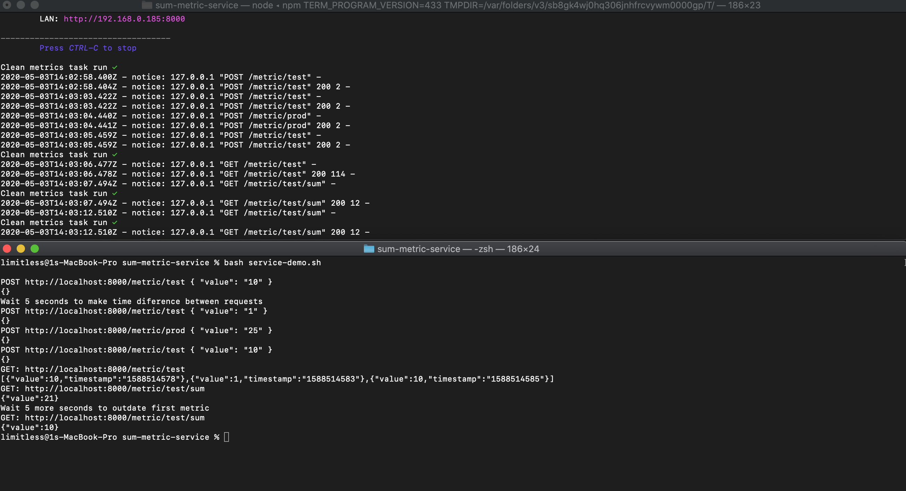

## Sum Metric Service

#### Demo with metric lifetime of 10 seconds
GIF

PNG

## Available Scripts

In the project directory, you can run:

### `yarn start`

Runs the server on http://localhost:8000/ by default.

Available env variables:

`PORT` - define a specific port

`HOST` - define a specific host

`METRIC_LIFETIME` - define a specific metric lifetime, by default is set to 1 hour.

### Test API

Save metric by key

`curl -H "Content-Type: application/json" --request POST --data '{ "value": "10" }' http://localhost:8000/metric/:key`

Get sum of all metrics by key

`curl -H "Content-Type: application/json" --request GET http://localhost:8000/metric/:key/sum`

Get all metrics by key

`curl -H "Content-Type: application/json" --request GET http://localhost:8000/metric/:key`
